# Thinkwerke CIR³ Framework  
### Continuous Intelligence · Integration · Resilience  
*A Unified Compliance & Cybersecurity Framework for Utilities and Critical Infrastructure*

---

## Overview  
The **CIR³ Framework** (Continuous Intelligence · Integration · Resilience) is a **strategic–technical compliance model** designed by **Thinkwerke** to operationalize European cybersecurity and AI governance laws, including the **EU NIS2 Directive**, **EU AI Act**, and **Cyber Resilience Act (CRA)** under a unified management system aligned to **ISO/IEC 27001** and **ENISA maturity guidance**.

| **Dimension** | **Description** | **Core Purpose** |
|----------------|------------------|------------------|
| **C¹ – Continuous Intelligence** | Data awareness, visibility, and AI-driven insights across the enterprise. | Know what’s happening. |
| **C² – Continuous Integration** | Embedding compliance, AI governance, and security controls directly into delivery and CI/CD pipelines. | Build compliance by design. |
| **C³ – Continuous Resilience** | Sustained audit-readiness, ENISA-aligned improvement, and governance assurance. | Prove and sustain governance. |

CIR³ enables organizations to **move from regulatory obligation to proactive resilience**, integrating governance, AI oversight, and product security within the same operational ecosystem.  
(“³” conveys power of three, iteration, and self-reinforcing loop.)

---

## Framework Philosophy  
The CIR³ Framework is founded on three core principles:

| **Pillar** | **Purpose** | **Outcome** |
|-------------|--------------|-------------|
| **Continuous Intelligence** | Establish real-time visibility of assets, risk, and compliance posture across cloud, data, and AI systems. | Data-driven risk and compliance awareness enabling proactive decisions. |
| **Continuous Integration** | Align organizational, AI, and product-level security controls into a single operational workflow. | Unified compliance where NIS2, AI Act, and CRA controls are implemented once, reused across frameworks. |
| **Continuous Resilience** | Sustain adaptive improvement through automation, audit readiness, and human oversight (HITL). | Long-term resilience and trust, ensuring evidence-based governance and continuous regulatory alignment. |

---

# Purpose of the Thinkwerke CIR³ Framework

The **Thinkwerke CIR³ Framework** (Continuous Intelligence, Integration, and Resilience) is designed to transform compliance from a reactive documentation exercise into an intelligent, continuous, and measurable governance capability.  

Developed with direct alignment to **BSI IT-Grundschutz**, **ENISA Baseline Controls**, and the legislative foundations of the **EU NIS2 Directive**, **EU AI Act**, and **Cyber Resilience Act (CRA)**, it establishes a single, integrated model for technical, organizational, and legal compliance.  

The framework embeds governance directly into product delivery and AI operations, enabling **real-time assurance**, **automated evidence generation**, and **full regulatory traceability** across Azure and Databricks environments.  

Its modular design allows rapid extension to future directives such as **DORA** or the **EU Data Act**, ensuring long-term resilience and sustainable readiness for Diehl Metering’s AI-based solutions in the EU market.

```mermaid

flowchart LR
NIS2[NIS2 Directive] --> CIR3[Thinkwerke CIR3 Framework]
AIA[EU AI Act] --> CIR3
CRA[Cyber Resilience Act] --> CIR3
ISO[ISO 27001] --> CIR3
GDPR[GDPR] --> CIR3

CIR3 --> TOOLS[Azure & Databricks Toolchain]
TOOLS --> EVID[Automated Evidence & Control Mapping]
EVID --> REPORTS[Compliance Reports & Dashboards]
REPORTS --> VALUE[Business Outcomes: Trust · Readiness · Market Advantage]

```

## Core Purpose Explained

### 1. Operationalize Governance
CIR³ translates regulatory and policy requirements into *live, traceable control actions*.  
Every compliance obligation becomes a control element linked to measurable telemetry, data lineage, and process performance.  
This ensures that security, AI governance, and product conformity are **provable through continuous technical evidence**.

---

### 2. Integrate Compliance into Product Delivery
Compliance is embedded at every stage — from code to customer.  
Through DevSecOps pipelines, model governance, and automated documentation, each release inherently meets NIS2, AI Act, and CRA expectations.  
The framework turns compliance checks into **release gates**, ensuring conformity is achieved *by design* rather than by audit.

---

### 3. Enable Real-Time Assurance
CIR³ continuously validates posture against **ENISA Baseline Measures**, **BSI Grundschutz Controls**, and **ISO 27001 Annex A**.  
Executives can monitor compliance health via real-time dashboards reflecting incident trends, control performance, and AI risk metrics.  
This makes **continuous assurance** a business reality — not just an annual certification exercise.

---

### 4. Unify Legal, Technical, and Organizational Layers
CIR³ bridges the gap between **regulatory intent**, **technical enforcement**, and **executive oversight**.  
It harmonizes Governance, Risk, and Compliance (GRC) workflows with technical systems (SIEM, CSPM, IAM, AI governance tools), proving that governance is not theoretical — it’s *operational and auditable*.  

> **Thinkwerke Note:**  
> *“GRC doesn’t replace technical tools (SIEM, CSPM, IAM, ticketing, scanning) — it glues them together and proves governance for regulators, auditors, and management.”*

---

### 5. Developed on Verified European Standards
The CIR³ Framework has been developed **diligently and systematically**, reflecting the structure and intent of:
- **BSI IT-Grundschutz** (Germany’s core cybersecurity and critical infrastructure protection baseline)  
- **ENISA Cybersecurity Framework and Baseline Controls**  
- **EU Legislative Acts:**  
  - **Directive (EU) 2022/2555 – NIS2 Directive**  
  - **Regulation (EU) 2024/1689 – EU AI Act**  
  - **Regulation (EU) 2024/2847 – Cyber Resilience Act (CRA)**  

These foundations ensure that CIR³ is legally aligned, technically validated, and immediately applicable for entities classified as **Essential or Important under NIS2** or **High-Risk AI providers** under the AI Act.  

Furthermore, the framework is **future-diversifiable** — its modular structure allows rapid extension to include new or emerging EU regulations such as **DORA (Digital Operational Resilience Act)**, **Data Act**, or future **ENISA sector-specific directives**.

---

### 6. Scale and Sustain Compliance
CIR³ ensures compliance doesn’t degrade after project completion.  
Its modular architecture allows rapid mapping of new regulations, consistent control reuse, and automated documentation updates — ensuring **sustainable compliance continuity** without re-certification cycles.

## Architecture of the CIR³ Framework

| **Layer** | **Focus Area** | **Core Components (Azure / Databricks)** | **Linked Regulations & Standards** |
|------------|----------------|------------------------------------------|------------------------------------|
| **Governance Layer** | Risk management, policy, and accountability. | ServiceNow CMDB, Azure Policy, Purview lineage mapping. | NIS2 Art. 21(1), ISO 27001 A.5, ENISA Baseline 2023. |
| **Data & AI Layer** | AI risk, transparency, and explainability. | Unity Catalog, MLflow, AI Risk Register, SHAP/LIME explainability. | EU AI Act Arts. 9–15, ISO 42001, GDPR. |
| **Security & Infrastructure Layer** | Infrastructure hardening, vulnerability mgmt, access control. | Defender for Cloud, Private Link, PIM/MFA, ACR image scans. | CRA Annex I–II, NIS2 Art. 21(2)(a–f). |
| **Operational Layer** | Incident, continuity, and post-market monitoring. | Sentinel, Logic Apps (24h/72h reporting), Grafana dashboards. | NIS2 Art. 23, ENISA IR Guidelines. |
| **Resilience Layer** | Continuous improvement, learning, and audit evidence. | CIR³ Dashboard, automated compliance matrix, KPI tracking. | ISO 27001 A.9, ENISA Maturity Model 2024. |

---

## Phased Implementation Model

| **Phase** | **Objective** | **Deliverables** | **Success Indicators** |
|------------|----------------|------------------|------------------------|
| **Phase 1 – Continuous Intelligence** | Build visibility and baseline for compliance maturity. | - ENISA-aligned Asset Register    - Risk Ownership Map    - Sentinel & Purview dashboards | Clear visibility of all critical systems and data flows. |
| **Phase 2 – Continuous Integration** | Implement unified technical & organizational controls. | - NIS2 + AI Act + CRA control mapping    - HITL workflow definition    - AI Risk Register | Shared compliance evidence across domains; reduced audit overlap. |
| **Phase 3 – Continuous Resilience** | Maintain continuous monitoring, improvement, and evidence. | - ENISA-style Quarterly Reports    - CIR³ Compliance Dashboard    - ISO 27001 Readiness Pack | Demonstrable resilience and executive-level visibility. |

---

## Key Benefits for Utilities / Critical Infrastructure

| **Dimension** | **Challenge** | **How CIR³ Solves It** |
|----------------|----------------|-------------------------|
| **Governance** | Fragmented regulatory obligations (NIS2, AI Act, CRA) | Provides unified governance model integrated into ISMS. |
| **Technical Compliance** | Siloed Azure / Databricks environments without traceability | Enables end-to-end asset, data, and AI traceability. |
| **Operational Oversight** | Complex incident reporting & evidence management | Automates ENISA and authority-compliant reporting workflows. |
| **Human Accountability** | Lack of ownership or clarity in AI decisions (HITL) | Defines HITL roles, processes, and auditable evidence. |
| **Audit Readiness** | Manual compliance documentation | Provides continuous audit trails and ENISA-formatted summaries. |

---

- **Compliance Outcome:**  
  - 80% overlap with ISO 27001 controls  
  - Real-time visibility for NIS2 and AI Act compliance status  
  - CRA readiness through secure-by-design engineering and SBOM automation  

---

## Strategic Advantage   

> CIR³ transforms compliance into a **living system** measurable, teachable, and continuously improving.
> Every regulatory control becomes a business enabler, turning compliance into **competitive resilience**.

---

# THINKWERKE CIR³ FRAMEWORK — VALUE POINTS

## 1. Unified Governance Across All EU Regulations
The Thinkwerke CIR³ Framework consolidates requirements from **NIS2**, **EU AI Act**, **CRA**, and **ISO 27001** into a single operational model.  
This eliminates duplication, simplifies audits, and ensures every control or policy change is reflected across all compliance obligations in real time.  
**Outcome:** One compliance investment supports four EU frameworks — achieving a **40% reduction in regulatory duplication** (ENISA benchmark).

---

## 2. Continuous Intelligence
CIR³ introduces continuous visibility into assets, risks, and compliance status through Azure-native telemetry and AI-driven analytics.  
Sentinel, Purview, and Databricks pipelines are unified into a living compliance dashboard that detects risk deviations instantly.  
**Outcome:** Decision-making based on live compliance intelligence, not retrospective reports.

---

## 3. Continuous Integration
Compliance is embedded directly into the CI/CD pipeline making every deployment verifiable and compliant by design.  
CIR³ automatically validates controls, HITL workflows, and AI model documentation before release.  
**Outcome:** Each release becomes a compliance checkpoint, drastically shortening audit cycles and ensuring provable traceability.

---

## 4. Continuous Resilience
Resilience becomes measurable and repeatable.  
Through evidence automation, ENISA-aligned risk registers, and ISO 27001 mappings, CIR³ continuously validates security posture and regulatory readiness.  
**Outcome:** Always-audit-ready operations resilience becomes part of the delivery culture.

---

## 5. Evidence-as-Code Automation
CIR³ replaces manual documentation with **automated, machine-generated evidence** collected from Azure, Databricks, and connected services.  
This enables one-click generation of compliance reports, CE declarations, and AI conformity files.  
**Outcome:** **Up to 70% reduction in audit preparation time** and full alignment with ENISA evidence frameworks.

---

## 6. Integrated Product & Data Compliance
The Framework bridges AI, cybersecurity, and data governance within one architecture. linking **NIS2 (security)**, **AI Act (ethics)**, **CRA (product)**, and **ISO 27001 (process)**.  
**Outcome:** Unified risk ownership across engineering, compliance, and product management, ensuring AI systems are secure, explainable, and legally defensible.

---

## 7. Executive-Level Transparency
CIR³ transforms compliance from a technical silo into an executive decision tool.  
Through unified dashboards and ENISA-format scorecards, leadership gains visibility into:
- Control readiness per directive  
- Audit evidence progress  
- Incident response metrics  
**Outcome:** Compliance becomes a measurable governance KPI at board level.

---

## 8. Scalable & Reusable Architecture
Built once, applied everywhere, CIR³’s modular design supports rapid onboarding of new teams, regions, or regulatory scopes.  
It grows with the organization, maintaining control consistency and audit readiness across global deployments.  
**Outcome:** **Compliance scalability without additional cost or resource overhead.**

---

## 9. Knowledge Transfer
Unlike external consultants who operate in isolation, Thinkwerke’s methodology builds permanent internal competence.  
CIR³ embeds compliance ownership into engineering workflows, enabling cross-functional teams to sustain and evolve compliance independently.  
**Outcome:** True self-sufficiency, your people own the process, not a third party.

---

## 10. Strategic Trust & Market Advantage
The culmination of CIR³ is *trust that can be proven.*  
When customers, partners, or regulators request evidence, it’s already there, live, current, and standardized.  
**Outcome:** Diehl Metering positions itself as one of the few EU utility innovators capable of *demonstrating* compliance, not just claiming it accelerating partnerships, contracts, and public-sector readiness.

---

## Quick Overlap Map — EU AI Act vs NIS2 vs ISO 27001

| **Control Domain**        | **EU AI Act**                                         | **NIS2 Directive**                               | **ISO 27001 (2022)**                           |
|----------------------------|-------------------------------------------------------|--------------------------------------------------|------------------------------------------------|
| **Risk Management**        | *Art. 9* – Risk management system                    | *Art. 21* – Risk management measures             | Clause 6 – Planning and risk treatment         |
| **Data Governance**        | *Art. 10* – Data governance and data quality         | *Art. 21* – Operational security measures        | Annex A 8 – Information classification         |
| **Access Control**         | *Art. 15* – Security for high-risk AI systems        | *Art. 21* – Access control and identity          | Annex A 5 & 8 – Access management              |
| **Logging & Monitoring**  | *Art. 12* – Logging of high-risk AI activities       | *Art. 21* – Monitoring and detection             | Annex A 8 – Logging and monitoring             |
| **Incident Response**      | *Art. 62* – Incident reporting obligations           | *Art. 23* – Incident notification timelines      | Annex A 5 & 8 – Incident management            |
| **Supplier Security**      | Annex IV – Technical file / vendor artifacts         | *Art. 21* – Supply chain security                | Annex A 5 – Supplier relationships             |
| **Backup & Continuity**    | (Not explicit; supports robustness via Art. 15)      | *Art. 21* – Backup and disaster recovery         | Annex A 5 & 8 – Business continuity            |
| **AI Oversight / HITL**    | *Art. 14* – Human-in-the-loop oversight              | (Not explicit; supports governance)              | Annex A 5 – Roles and responsibilities         |

> **Note:** “Not explicit” means the directive or standard does not define a standalone clause but supports the concept through governance or operational measures.

## 🧩 Overlap Map — NIS2 · EU AI Act · Cyber Resilience Act (CRA) vs ISO 27001

| **Control Domain**         | **NIS2 Directive**                                   | **EU AI Act**                                       | **Cyber Resilience Act (CRA)**                                   | **ISO 27001 (2022)**                                  |
|-----------------------------|------------------------------------------------------|------------------------------------------------------|------------------------------------------------------------------|--------------------------------------------------------|
| **Risk Management**         | *Art. 21(1–2)* – Security & risk management measures | *Art. 9* – AI risk management system                 | *Annex I* – Product design and risk assessment                   | Clause 6 – Planning and risk treatment                |
| **Incident Response**       | *Art. 23* – Incident notification & coordination     | *Art. 62* – Reporting of serious incidents           | *Art. 11* – Vulnerability disclosure within 24 h                 | Annex A 5 & 8 – Incident management                   |
| **Access Control & Identity** | *Art. 21(2)* – Access control, least privilege       | *Art. 15* – Robustness & cybersecurity of AI systems | *Annex I* – Secure configuration, identity, and authentication   | Annex A 5 & 8 – Access management                     |
| **Logging & Monitoring**   | *Art. 21(2)(d)* – Detection and logging              | *Art. 12* – AI system logging requirements           | *Annex I* – Event logging and integrity                          | Annex A 8 – Logging and monitoring                    |
| **Supplier & Supply Chain Security** | *Art. 21(2)(f)* – Supply chain security          | Annex IV – Technical documentation for suppliers     | *Annex II* – Component supplier obligations                      | Annex A 5 – Supplier relationships                    |
| **Data Governance & Quality** | *Art. 21(2)* – Operational security controls        | *Art. 10* – Data governance & dataset quality        | *Annex I* – Secure data handling and validation                  | Annex A 8 – Information classification                |
| **Backup & Continuity**     | *Art. 21(2)(e)* – Backup and disaster recovery       | (Indirect support via robustness requirements)       | *Annex I* – Recovery and patch management processes              | Annex A 5 & 8 – Business continuity management        |
| **Vulnerability Management**| *Art. 21(2)(d)* – Vulnerability handling             | *Art. 15* – AI robustness and vulnerability testing  | *Art. 10–11* – Vulnerability handling and patch policy           | Annex A 8 – Vulnerability management                  |
| **Secure Development (SDLC)**| *Art. 21(2)(d)* – Security by design                | *Art. 15* – Robustness, testing, secure design       | *Annex I* – Secure product lifecycle                             | Annex A 8 – Secure development lifecycle              |
| **AI Oversight / HITL**     | (Not explicit; part of governance measures)          | *Art. 14* – Human oversight (HITL)                   | (Not applicable directly)                                        | Annex A 5 – Roles and responsibilities                |

> **Note:** Controls highlighted across NIS2, AI Act, and CRA demonstrate that a single ISO 27001-aligned control framework can produce reusable evidence across all three regulations. This underpins the Thinkwerke CIR³ approach — *implement once, prove everywhere*.

**Prepared by:** Thinkwerke – Strategy Meets Security  
**Date:** October 2025  
**Framework Author:** Mayank Sekhar, CISM · ISO 27001 LI · AWS SA Pro · CompTIA SecurityX Architect · NIS2 and DORA Trained Pro
