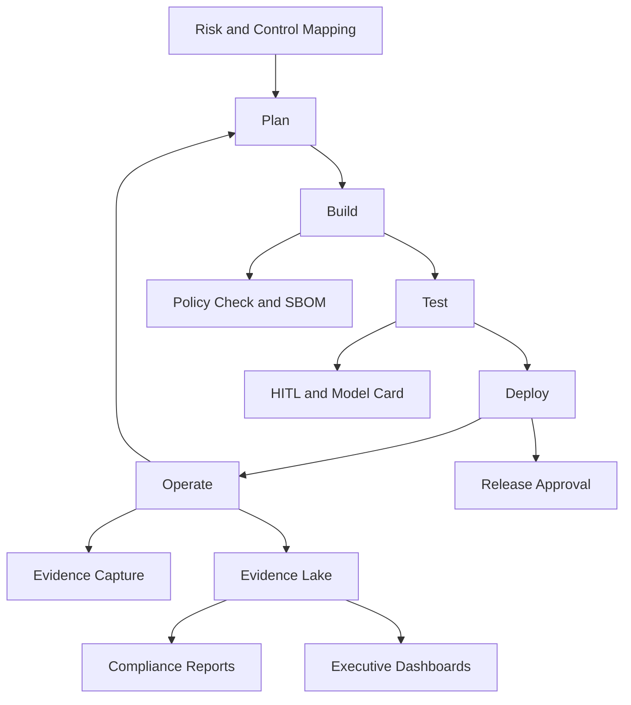

### **NIS2 Control Implementation & Evidence Register (Thinkwerke Framework)**

| **Requirement** | **Control Objective** | **Linked Article / Reference** | **Status / Implementation Evidence** |
|-----------------|-----------------------|--------------------------------|--------------------------------------|
| **Asset Inventory in CMDB** | Ensure all critical assets and systems are identified, tracked, and linked to a configuration management database (CMDB). | Art. 21(2)(a) | Entry exists in CMDB (ID recorded) |
| **Vulnerability Management Process** | Establish continuous vulnerability identification, assessment, and remediation with a defined schedule. | Art. 21(2)(d) | Linked process and schedule defined |
| **Incident Reporting & Contact Runbook** | Implement incident reporting procedures with defined roles, escalation contacts, and integration into operational repositories. | Art. 23 | Incident response runbook documented |
| **Backup & Recovery Procedures** | Maintain tested and documented backup and recovery plans to ensure business continuity. | Art. 21(2)(e) | Backup and recovery tested and verified |
| **Supplier Risk Assessment** | Evaluate suppliers, dependencies, and external service providers for security posture and contractual risk exposure. | Art. 21(2)(d,f) | Supplier risk analysis completed |
| **Data Transfer & Legal Basis (EU Conditional)** | Validate GDPR alignment and cross-border data transfer compliance for EU-based data processing. | GDPR / NIS2 interplay | Data transfer and legal basis reviewed |

### **NIS2 Control Implementation & Evidence Register (Thinkwerke Framework)**

| **Requirement** | **Control Objective** | **Linked Article / Reference** | **Status / Implementation Evidence** |
|-----------------|-----------------------|--------------------------------|--------------------------------------|
| **Asset Inventory in CMDB** | Ensure all critical assets and systems are identified, tracked, and linked to a configuration management database (CMDB). | Art. 21(2)(a) | Entry exists in CMDB (ID recorded) |
| **Vulnerability Management Process** | Establish continuous vulnerability identification, assessment, and remediation with a defined schedule. | Art. 21(2)(d) | Linked process and schedule defined |
| **Incident Reporting & Contact Runbook** | Implement incident reporting procedures with defined roles, escalation contacts, and integration into operational repositories. | Art. 23 | Incident response runbook documented |
| **Backup & Recovery Procedures** | Maintain tested and documented backup and recovery plans to ensure business continuity. | Art. 21(2)(e) | Backup and recovery tested and verified |
| **Supplier Risk Assessment** | Evaluate suppliers, dependencies, and external service providers for security posture and contractual risk exposure. | Art. 21(2)(d,f) | Supplier risk analysis completed |
| **Data Transfer & Legal Basis (EU Conditional)** | Validate GDPR alignment and cross-border data transfer compliance for EU-based data processing. | GDPR / NIS2 interplay | Data transfer and legal basis reviewed |

