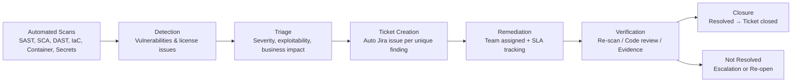

```mermaid

flowchart LR
    A[Automated Scans<br>SAST, SCA, DAST, IaC, Container, Secrets] --> B[Detection<br>Vulnerabilities & license issues]
    B --> C[Triage<br>Severity, exploitability, business impact]
    C --> D[Ticket Creation<br>Auto Jira issue per unique finding]
    D --> E[Remediation<br>Team assigned + SLA tracking]
    E --> F[Verification<br>Re-scan / Code review / Evidence]
    
    F --> G[Closure<br>Resolved → Ticket closed]
    F --> H[Not Resolved<br>Escalation or Re-open]

```

