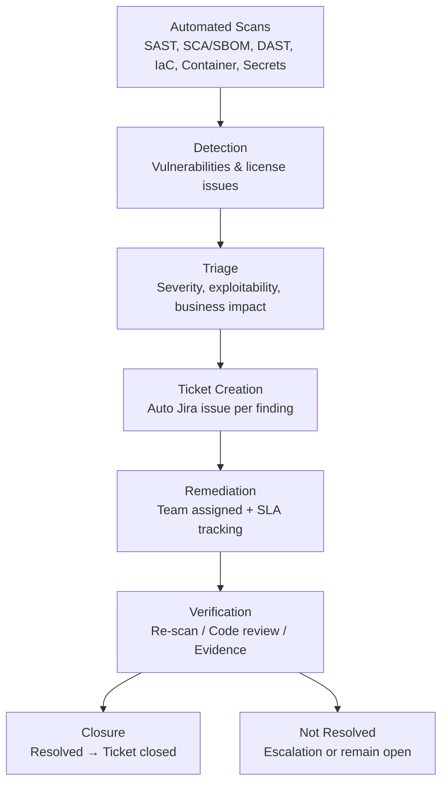

```mermaid

flowchart TB
    A[Automated Scans<br>SAST, SCA/SBOM, DAST, IaC, Container, Secrets]
    B[Detection<br>Vulnerabilities & license issues]
    C[Triage<br>Severity, exploitability, business impact]
    D[Ticket Creation<br>Auto Jira issue per finding]
    E[Remediation<br>Team assigned + SLA tracking]
    F[Verification<br>Re-scan / Code review / Evidence]
    G[Closure<br>Resolved → Ticket closed]
    H[Not Resolved<br>Escalation or remain open]

    A --> B --> C --> D --> E --> F
    F --> G
    F --> H


```

