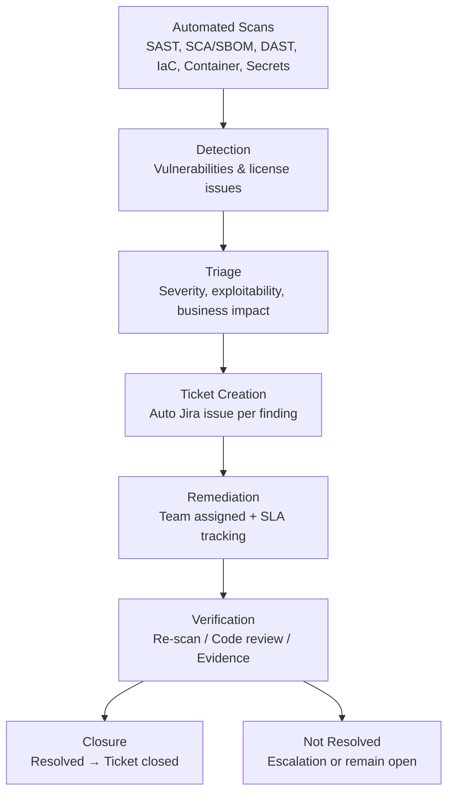
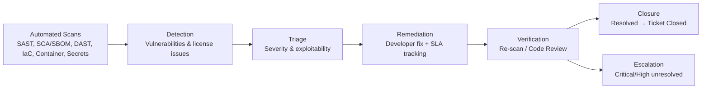
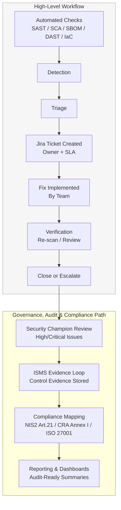

```mermaid

flowchart TB
    A[Automated Scans<br>SAST, SCA/SBOM, DAST, IaC, Container, Secrets]
    B[Detection<br>Vulnerabilities & license issues]
    C[Triage<br>Severity, exploitability, business impact]
    D[Ticket Creation<br>Auto Jira issue per finding]
    E[Remediation<br>Team assigned + SLA tracking]
    F[Verification<br>Re-scan / Code review / Evidence]
    G[Closure<br>Resolved → Ticket closed]
    H[Not Resolved<br>Escalation or remain open]

    A --> B --> C --> D --> E --> F
    F --> G
    F --> H


```

```mermaid

flowchart LR

    A[Automated Scans<br>SAST, SCA/SBOM, DAST, IaC, Container, Secrets]
    B[Detection<br>Vulnerabilities & license issues]
    C[Triage<br>Severity & exploitability]
    D[Remediation<br>Developer fix + SLA tracking]
    E[Verification<br>Re-scan / Code Review]
    F[Closure<br>Resolved → Ticket Closed]
    G[Escalation<br>Critical/High unresolved]

    A --> B --> C --> D --> E --> F
    E --> G


```

```mermaid

flowchart TB

%% ---------------------------
%% TOP SECTION (HORIZONTAL)
%% ---------------------------

subgraph TOP[High-Level Workflow]
direction LR
    A[Automated Checks<br>SAST / SCA / SBOM / DAST / IaC] --> B[Detection]
    B --> C[Triage]
    C --> D[Jira Ticket Created<br>Owner + SLA]
    D --> E[Fix Implemented<br>By Team]
    E --> F[Verification<br>Re-scan / Review]
    F --> G[Close or Escalate]
end

%% Space for visual separation
style TOP fill:#f6f6f6,stroke:#aaa,stroke-width:1px

%% ---------------------------
%% BOTTOM SECTION (VERTICAL)
%% ---------------------------

subgraph BOTTOM[Governance, Audit & Compliance Path]
direction TB
    H[Security Champion Review<br>High/Critical Issues]
    I[ISMS Evidence Loop<br>Control Evidence Stored]
    J[Compliance Mapping<br>NIS2 Art.21 / CRA Annex I / ISO 27001]
    K[Reporting & Dashboards<br>Audit-Ready Summaries]
end

%% Connections between sections
G --> H
H --> I
I --> J
J --> K


```
