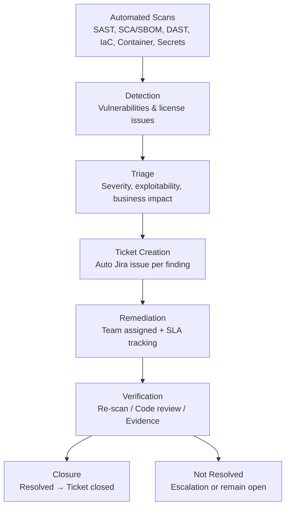
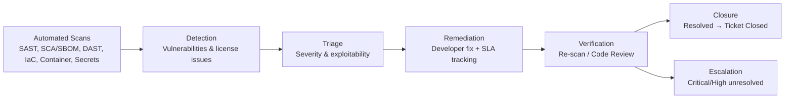

```mermaid

flowchart TB

%% ==========================
%% TOP: SSLM CHECKS (HORIZONTAL)
%% ==========================

subgraph SSLM [Secure Software Lifecycle Management (SSLM)]
direction LR

    A1[Code Commit]

    subgraph CHECKS [Automated Checks]
    direction LR
        B1[SAST<br>Static Code Analysis]
        B2[SCA & SBOM<br>Open-Source Components]
        B3[API Security Testing<br>REST / IoT APIs]
        B4[DAST<br>Runtime / Web Testing]
        B5[IaC Scanning<br>Cloud & Infra as Code]
        B6[Container Scanning]
        B7[Secrets Detection]
    end

    A1 --> B1
    A1 --> B2
    A1 --> B3
    A1 --> B4
    A1 --> B5
    A1 --> B6
    A1 --> B7
end

%% ==========================
%% MIDDLE: VULNERABILITY WORKFLOW (HORIZONTAL)
%% ==========================

subgraph WORKFLOW [Operational Vulnerability Workflow]
direction LR
    C1[Detection<br>Findings from SSLM]
    C2[Triage<br>Severity & Business Impact]
    C3[Jira Ticket Automation<br>Owner + SLA]
    C4[Remediation<br>Team Fix]
    C5[Security Champion Review<br>High/C]()


```
