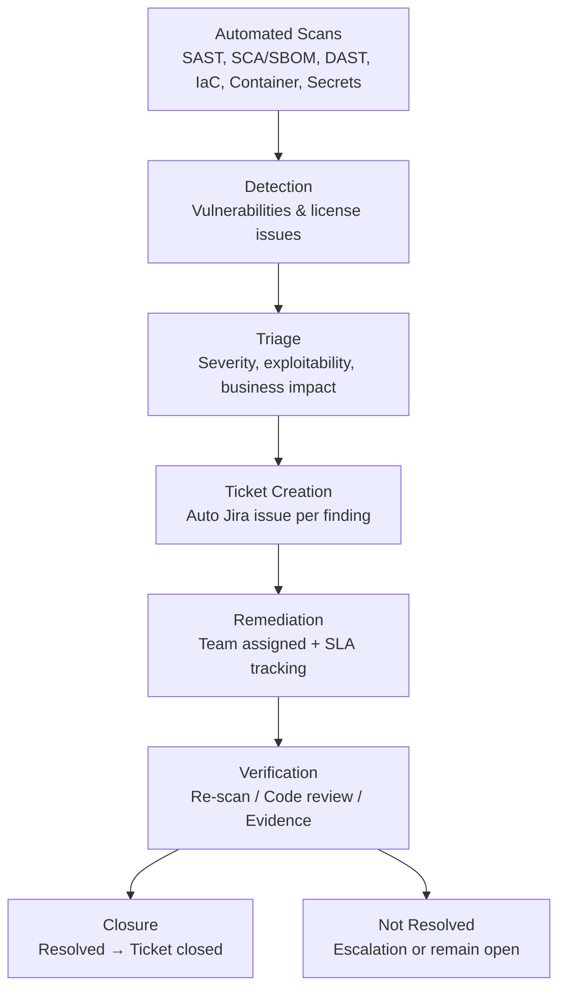
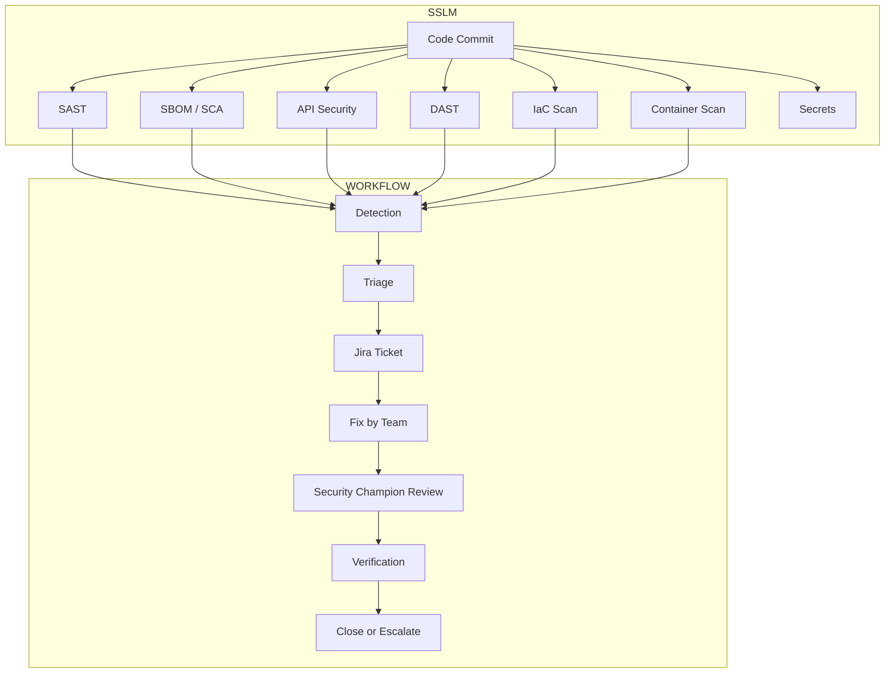
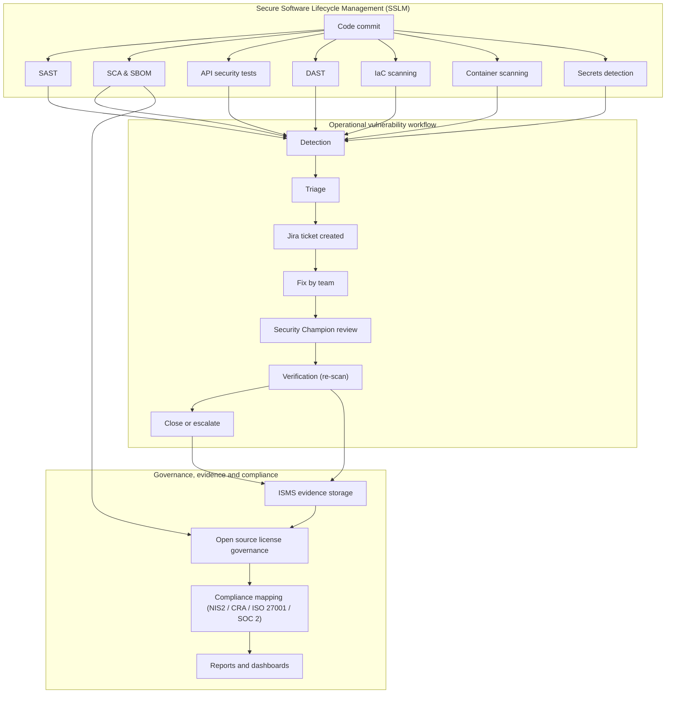
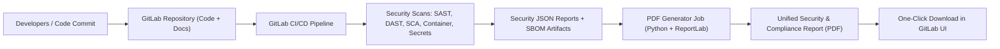
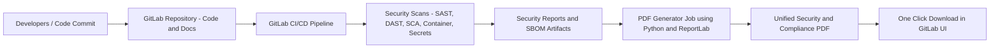

```mermaid

flowchart TB
    A[Automated Scans<br>SAST, SCA/SBOM, DAST, IaC, Container, Secrets]
    B[Detection<br>Vulnerabilities & license issues]
    C[Triage<br>Severity, exploitability, business impact]
    D[Ticket Creation<br>Auto Jira issue per finding]
    E[Remediation<br>Team assigned + SLA tracking]
    F[Verification<br>Re-scan / Code review / Evidence]
    G[Closure<br>Resolved → Ticket closed]
    H[Not Resolved<br>Escalation or remain open]

    A --> B --> C --> D --> E --> F
    F --> G
    F --> H


```

```mermaid

flowchart TB

%% ==========================
%% TOP SECTION (HORIZONTAL)
%% ==========================

subgraph SSLM
direction LR
A1[Code Commit]
B1[SAST]
B2[SBOM / SCA]
B3[API Security]
B4[DAST]
B5[IaC Scan]
B6[Container Scan]
B7[Secrets]

A1 --> B1
A1 --> B2
A1 --> B3
A1 --> B4
A1 --> B5
A1 --> B6
A1 --> B7
end

%% ==========================
%% MIDDLE SECTION (HORIZONTAL)
%% ==========================

subgraph WORKFLOW
direction LR
C1[Detection]
C2[Triage]
C3[Jira Ticket]
C4[Fix by Team]
C5[Security Champion Review]
C6[Verification]
C7[Close or Escalate]

C1 --> C2 --> C3 --> C4 --> C5 --> C6 --> C7
end

%% LINK SSLM TO WORKFLOW
B1 --> C1
B2 --> C1
B3 --> C1
B4 --> C1
B5 --> C1
B6 --> C1


```

```mermaid

flowchart TB

%% ==========================
%% TOP: SSLM CHECKS (HORIZONTAL)
%% ==========================

subgraph SSLM ["Secure Software Lifecycle Management (SSLM)"]
direction LR
    A1["Code commit"]

    B1["SAST"]
    B2["SCA & SBOM"]
    B3["API security tests"]
    B4["DAST"]
    B5["IaC scanning"]
    B6["Container scanning"]
    B7["Secrets detection"]

    A1 --> B1
    A1 --> B2
    A1 --> B3
    A1 --> B4
    A1 --> B5
    A1 --> B6
    A1 --> B7
end

%% ==========================
%% MIDDLE: VULNERABILITY WORKFLOW (HORIZONTAL)
%% ==========================

subgraph WORKFLOW ["Operational vulnerability workflow"]
direction LR
    C1["Detection"]
    C2["Triage"]
    C3["Jira ticket created"]
    C4["Fix by team"]
    C5["Security Champion review"]
    C6["Verification (re-scan)"]
    C7["Close or escalate"]

    C1 --> C2 --> C3 --> C4 --> C5 --> C6 --> C7
end

%% Link SSLM outputs into workflow
B1 --> C1
B2 --> C1
B3 --> C1
B4 --> C1
B5 --> C1
B6 --> C1
B7 --> C1

%% ==========================
%% BOTTOM: GOVERNANCE & COMPLIANCE (VERTICAL)
%% ==========================

subgraph GOVERNANCE ["Governance, evidence and compliance"]
direction TB
    D1["ISMS evidence storage"]
    D2["Open source license governance"]
    D3["Compliance mapping (NIS2 / CRA / ISO 27001 / SOC 2)"]
    D4["Reports and dashboards"]
    D1 --> D2 --> D3 --> D4
end

%% Connect workflow to governance
C6 --> D1
C7 --> D1
B2 --> D2


```

```mermaid


flowchart LR
    A["Developers / Code Commit"] --> B["GitLab Repository (Code + Docs)"]
    B --> C["GitLab CI/CD Pipeline"]
    C --> D["Security Scans: SAST, DAST, SCA, Container, Secrets"]
    D --> E["Security JSON Reports + SBOM Artifacts"]
    E --> F["PDF Generator Job (Python + ReportLab)"]
    F --> G["Unified Security & Compliance Report (PDF)"]
    G --> H["One-Click Download in GitLab UI"]


```

```mermaid


flowchart LR
    A[Developers / Code Commit] --> B[GitLab Repository - Code and Docs]
    B --> C[GitLab CI/CD Pipeline]
    C --> D[Security Scans - SAST, DAST, SCA, Container, Secrets]
    D --> E[Security Reports and SBOM Artifacts]
    E --> F[PDF Generator Job using Python and ReportLab]
    F --> G[Unified Security and Compliance PDF]
    G --> H[One Click Download in GitLab UI]


```
