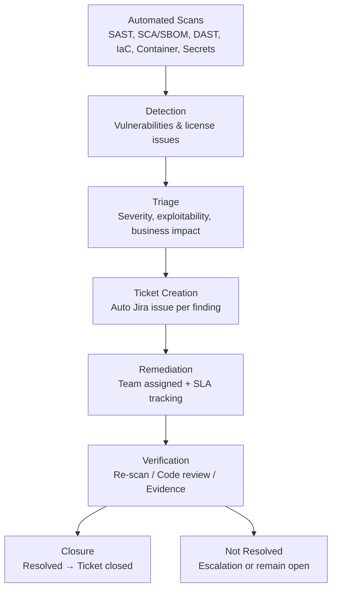
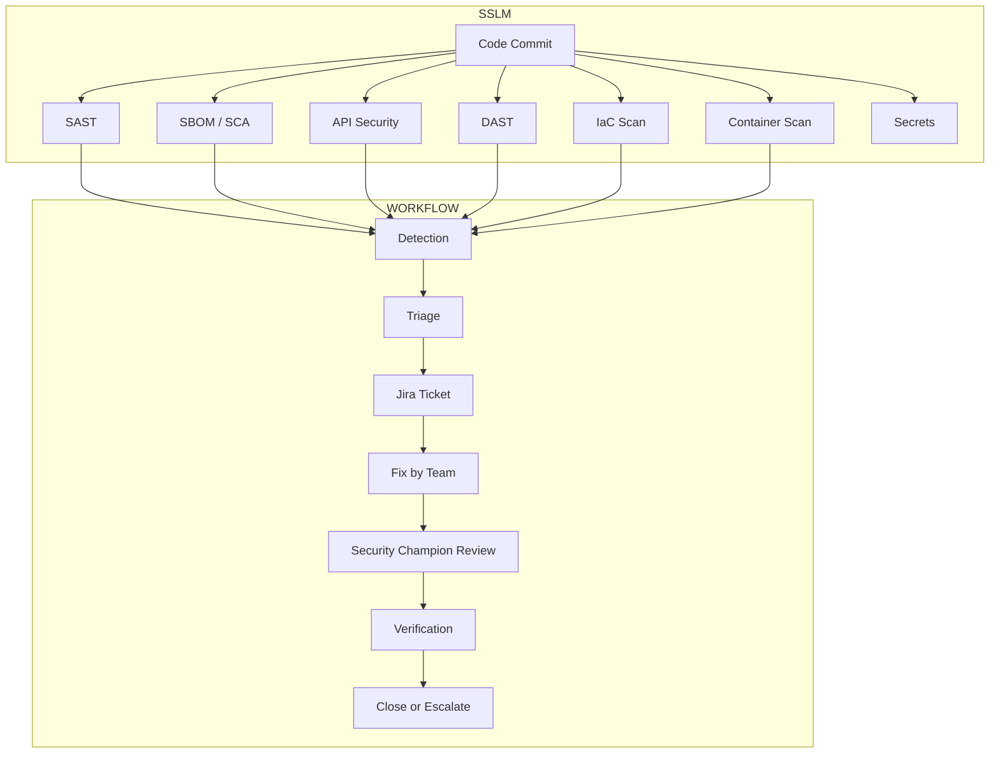

```mermaid

flowchart TB
    A[Automated Scans<br>SAST, SCA/SBOM, DAST, IaC, Container, Secrets]
    B[Detection<br>Vulnerabilities & license issues]
    C[Triage<br>Severity, exploitability, business impact]
    D[Ticket Creation<br>Auto Jira issue per finding]
    E[Remediation<br>Team assigned + SLA tracking]
    F[Verification<br>Re-scan / Code review / Evidence]
    G[Closure<br>Resolved → Ticket closed]
    H[Not Resolved<br>Escalation or remain open]

    A --> B --> C --> D --> E --> F
    F --> G
    F --> H


```

```mermaid

flowchart TB

%% ==========================
%% TOP SECTION (HORIZONTAL)
%% ==========================

subgraph SSLM
direction LR
A1[Code Commit]
B1[SAST]
B2[SBOM / SCA]
B3[API Security]
B4[DAST]
B5[IaC Scan]
B6[Container Scan]
B7[Secrets]

A1 --> B1
A1 --> B2
A1 --> B3
A1 --> B4
A1 --> B5
A1 --> B6
A1 --> B7
end

%% ==========================
%% MIDDLE SECTION (HORIZONTAL)
%% ==========================

subgraph WORKFLOW
direction LR
C1[Detection]
C2[Triage]
C3[Jira Ticket]
C4[Fix by Team]
C5[Security Champion Review]
C6[Verification]
C7[Close or Escalate]

C1 --> C2 --> C3 --> C4 --> C5 --> C6 --> C7
end

%% LINK SSLM TO WORKFLOW
B1 --> C1
B2 --> C1
B3 --> C1
B4 --> C1
B5 --> C1
B6 --> C1


```
