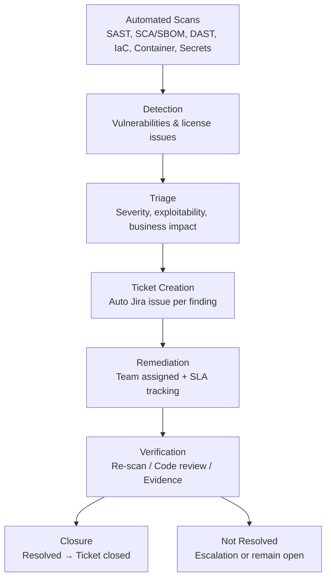
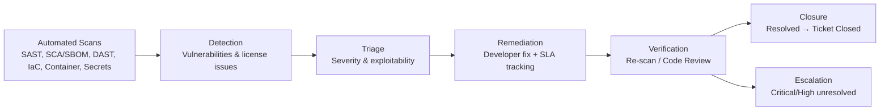
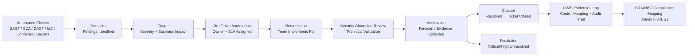

```mermaid

flowchart TB
    A[Automated Scans<br>SAST, SCA/SBOM, DAST, IaC, Container, Secrets]
    B[Detection<br>Vulnerabilities & license issues]
    C[Triage<br>Severity, exploitability, business impact]
    D[Ticket Creation<br>Auto Jira issue per finding]
    E[Remediation<br>Team assigned + SLA tracking]
    F[Verification<br>Re-scan / Code review / Evidence]
    G[Closure<br>Resolved → Ticket closed]
    H[Not Resolved<br>Escalation or remain open]

    A --> B --> C --> D --> E --> F
    F --> G
    F --> H


```

```mermaid

flowchart LR

    A[Automated Scans<br>SAST, SCA/SBOM, DAST, IaC, Container, Secrets]
    B[Detection<br>Vulnerabilities & license issues]
    C[Triage<br>Severity & exploitability]
    D[Remediation<br>Developer fix + SLA tracking]
    E[Verification<br>Re-scan / Code Review]
    F[Closure<br>Resolved → Ticket Closed]
    G[Escalation<br>Critical/High unresolved]

    A --> B --> C --> D --> E --> F
    E --> G


```

```mermaid

flowchart LR

    A[Automated Checks<br>SAST / SCA / DAST / IaC / Container / Secrets]
    B[Detection<br>Findings Identified]
    C[Triage<br>Severity + Business Impact]
    D[Jira Ticket Automation<br>Owner + SLA Assigned]
    E[Remediation<br>Team Implements Fix]
    F[Security Champion Review<br>Technical Validation]
    G[Verification<br>Re-scan / Evidence Collected]
    H[Closure<br>Resolved → Ticket Closed]
    I[Escalation<br>Critical/High Unresolved]
    J[ISMS Evidence Loop<br>Control Mapping + Audit Trail]
    K[CRA/NIS2 Compliance Mapping<br>Annex I / Art. 21]

    A --> B --> C --> D --> E --> F --> G --> H
    G --> I
    H --> J
    J --> K


```
