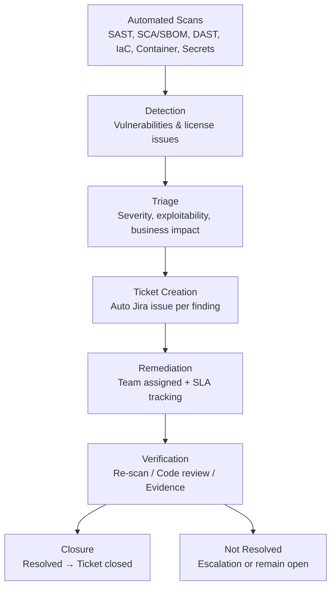
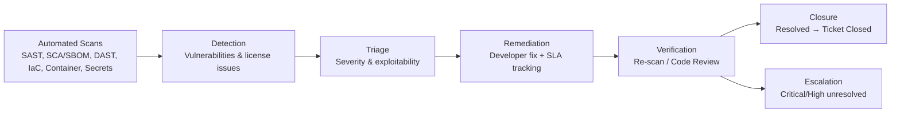

```mermaid

flowchart TB

%% ==========================
%% TOP: SSLM CHECKS (HORIZONTAL)
%% ==========================

subgraph SSLM[Secure Software Lifecycle Management (SSLM)]
direction LR

    A1[Code Commit]

    subgraph CHECKS[Automated Checks]
    direction LR
        B1[SAST<br>Static Code Analysis]
        B2[SCA & SBOM<br>Open-Source & Components]
        B3[API Security Testing<br>REST / IoT APIs]
        B4[DAST<br>Runtime/Web Testing]
        B5[IaC Scanning<br>Cloud & Infra as Code]
        B6[Container Scanning]
        B7[Secrets Detection]
    end

    A1 --> B1
    A1 --> B2
    A1 --> B3
    A1 --> B4
    A1 --> B5
    A1 --> B6
    A1 --> B7
end

style SSLM fill:#f7f7f7,stroke:#999,stroke-width:1px

%% ==========================
%% MIDDLE: VULNERABILITY WORKFLOW (HORIZONTAL)
%% ==========================

subgraph WORKFLOW[Operational Vulnerability Workflow]
direction LR

    C1[Detection<br>Findings from SSLM]
    C2[Triage<br>Severity & Business Impact]
    C3[Jira Ticket Automation<br>Owner + SLA]
    C4[Remediation<br>Team Fixes Issue]
    C5[Security Champion Review<br>High/Critical Only]
    C6[Verification<br>Re-scan / Review]
    C7[Closure or Escalation]

    C1 --> C2 --> C3 --> C4 --> C5 --> C6 --> C7
end

style WORKFLOW fill:#fdfdfd,stroke:#999,stroke-width:1px

%% LINK SSLM TO WORKFLOW
B1 --> C1
B2 --> C1
B3 --> C1
B4 --> C1
B5 --> C1
B6 --> C1
B7 --> C1

%% ==========================
%% BOTTOM: GOVERNANCE & COMPLIANCE (VERTICAL)
%% ==========================

subgraph GOV[Governance, Evidence & Compliance]
direction TB

    D1[ISMS Evidence Loop<br>Store Findings, Fixes, SBOMs]
    D2[Open Source License Governance<br>Copyleft vs Allowed]
    D3[Compliance Mapping<br>NIS2 • CRA • ISO 27001 • SOC 2]
    D4[Reporting & Dashboards<br>Exec & Audit Views]

    D1 --> D2 --> D3 --> D4
end

style GOV fill:#f7f7ff,stroke:#999,stroke-width:1px

%% LINK WORKFLOW TO GOVERNANCE
C6 --> D1
C7 --> D1
B2 --> D2  %% SBOM & license data also feed governance


```
