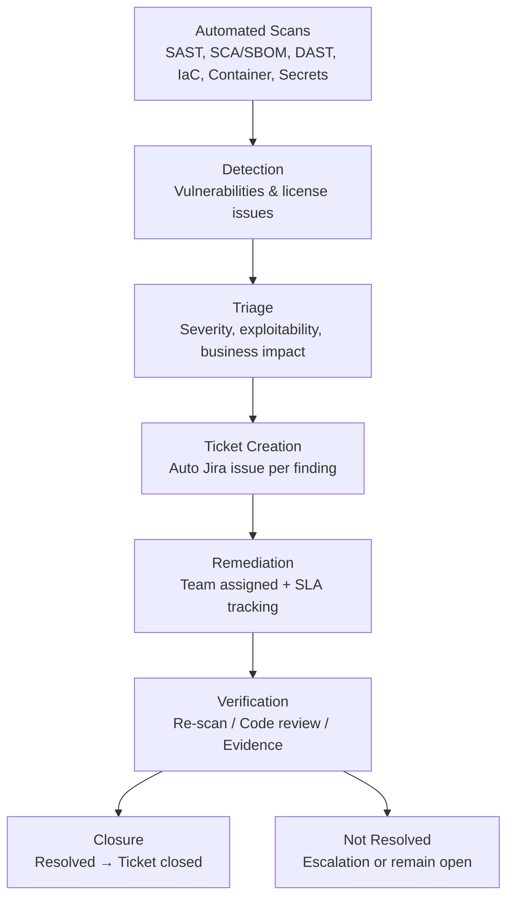
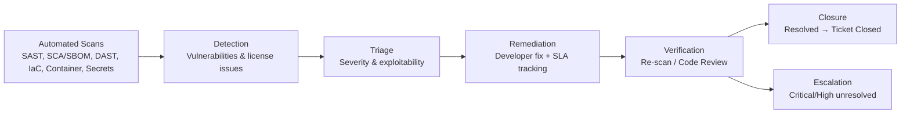
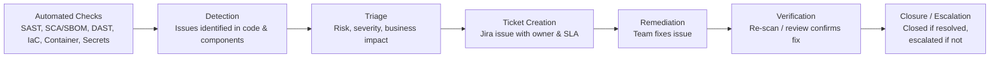

```mermaid

flowchart TB
    A[Automated Scans<br>SAST, SCA/SBOM, DAST, IaC, Container, Secrets]
    B[Detection<br>Vulnerabilities & license issues]
    C[Triage<br>Severity, exploitability, business impact]
    D[Ticket Creation<br>Auto Jira issue per finding]
    E[Remediation<br>Team assigned + SLA tracking]
    F[Verification<br>Re-scan / Code review / Evidence]
    G[Closure<br>Resolved → Ticket closed]
    H[Not Resolved<br>Escalation or remain open]

    A --> B --> C --> D --> E --> F
    F --> G
    F --> H


```

```mermaid

flowchart LR

    A[Automated Scans<br>SAST, SCA/SBOM, DAST, IaC, Container, Secrets]
    B[Detection<br>Vulnerabilities & license issues]
    C[Triage<br>Severity & exploitability]
    D[Remediation<br>Developer fix + SLA tracking]
    E[Verification<br>Re-scan / Code Review]
    F[Closure<br>Resolved → Ticket Closed]
    G[Escalation<br>Critical/High unresolved]

    A --> B --> C --> D --> E --> F
    E --> G


```

```mermaid

flowchart LR

    A[Automated Checks<br>SAST, SCA/SBOM, DAST, IaC, Container, Secrets]
    B[Detection<br>Issues identified in code & components]
    C[Triage<br>Risk, severity, business impact]
    D[Ticket Creation<br>Jira issue with owner & SLA]
    E[Remediation<br>Team fixes issue]
    F[Verification<br>Re-scan / review confirms fix]
    G[Closure / Escalation<br>Closed if resolved,<br>escalated if not]

    A --> B --> C --> D --> E --> F --> G


```
