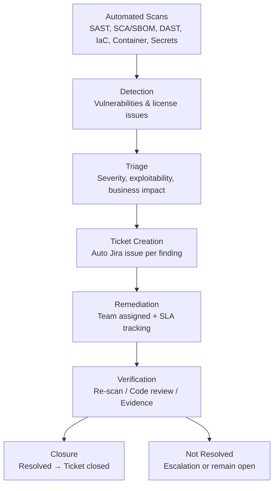
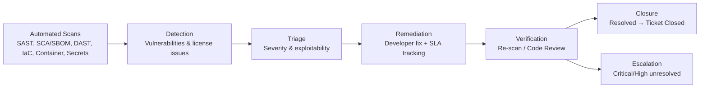
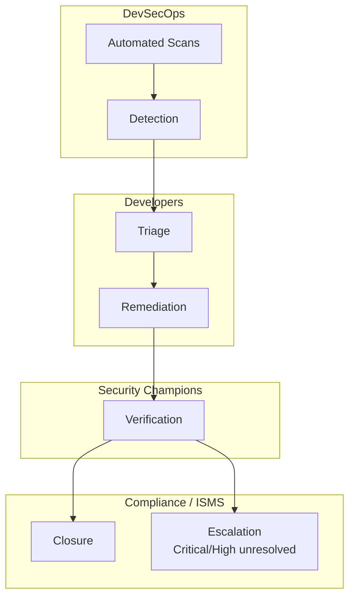

```mermaid

flowchart TB
    A[Automated Scans<br>SAST, SCA/SBOM, DAST, IaC, Container, Secrets]
    B[Detection<br>Vulnerabilities & license issues]
    C[Triage<br>Severity, exploitability, business impact]
    D[Ticket Creation<br>Auto Jira issue per finding]
    E[Remediation<br>Team assigned + SLA tracking]
    F[Verification<br>Re-scan / Code review / Evidence]
    G[Closure<br>Resolved → Ticket closed]
    H[Not Resolved<br>Escalation or remain open]

    A --> B --> C --> D --> E --> F
    F --> G
    F --> H


```

```mermaid

flowchart LR

    A[Automated Scans<br>SAST, SCA/SBOM, DAST, IaC, Container, Secrets]
    B[Detection<br>Vulnerabilities & license issues]
    C[Triage<br>Severity & exploitability]
    D[Remediation<br>Developer fix + SLA tracking]
    E[Verification<br>Re-scan / Code Review]
    F[Closure<br>Resolved → Ticket Closed]
    G[Escalation<br>Critical/High unresolved]

    A --> B --> C --> D --> E --> F
    E --> G


```

```mermaid
flowchart TB

    subgraph DevSecOps[DevSecOps]
        A[Automated Scans]
        B[Detection]
    end

    subgraph Developers[Developers]
        C[Triage]
        D[Remediation]
    end

    subgraph SecurityChampions[Security Champions]
        E[Verification]
    end

    subgraph Compliance[Compliance / ISMS]
        F[Closure]
        G[Escalation<br>Critical/High unresolved]
    end

    A --> B --> C --> D --> E --> F
    E --> G

```
