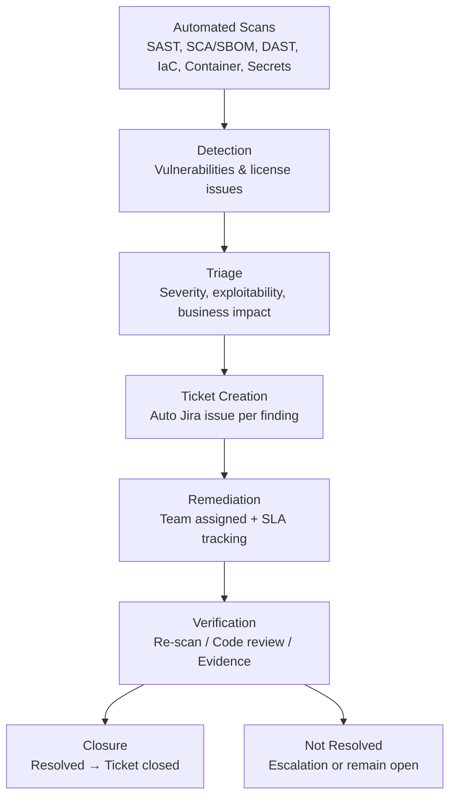
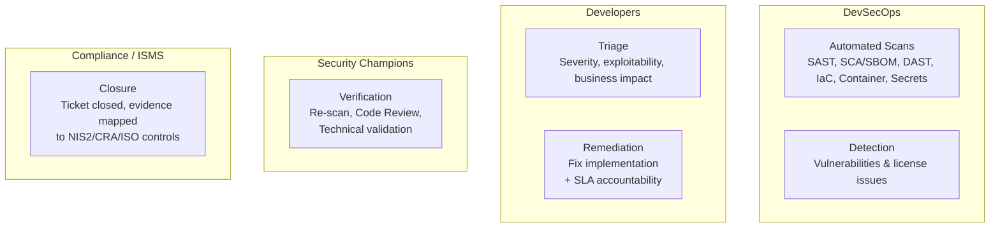

```mermaid

flowchart TB
    A[Automated Scans<br>SAST, SCA/SBOM, DAST, IaC, Container, Secrets]
    B[Detection<br>Vulnerabilities & license issues]
    C[Triage<br>Severity, exploitability, business impact]
    D[Ticket Creation<br>Auto Jira issue per finding]
    E[Remediation<br>Team assigned + SLA tracking]
    F[Verification<br>Re-scan / Code review / Evidence]
    G[Closure<br>Resolved → Ticket closed]
    H[Not Resolved<br>Escalation or remain open]

    A --> B --> C --> D --> E --> F
    F --> G
    F --> H


```

```mermaid

flowchart TB

    %% Lanes
    subgraph DevSecOps[DevSecOps]
        A[Automated Scans<br>SAST, SCA/SBOM, DAST, IaC, Container, Secrets]
        B[Detection<br>Vulnerabilities & license issues]
    end

    subgraph Developers[Developers]
        C[Triage<br>Severity, exploitability, business impact]
        D[Remediation<br>Fix implementation<br>+ SLA accountability]
    end

    subgraph SecurityChampions[Security Champions]
        E[Verification<br>Re-scan, Code Review,<br>Technical validation]
    end

    subgraph Compliance[Compliance / ISMS]
        F[Closure<br>Ticket closed, evidence mapped<br>to NIS2/CRA/ISO controls]
    end

```
    %% Flows
    A --> B --> C --> D --> E --> F
